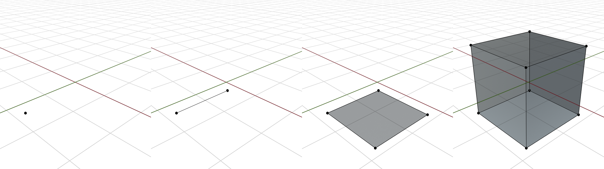
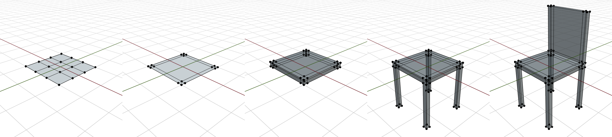
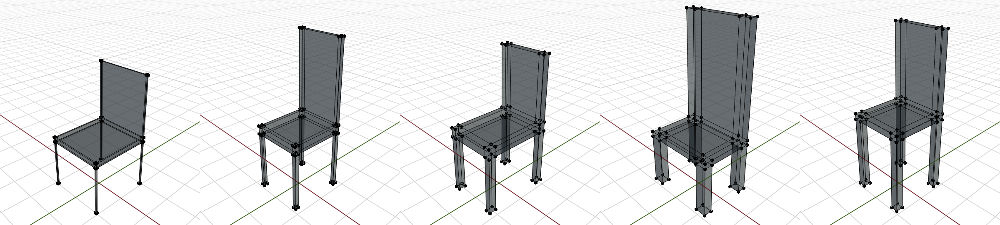
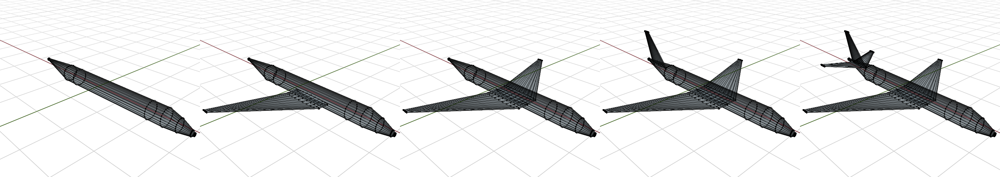
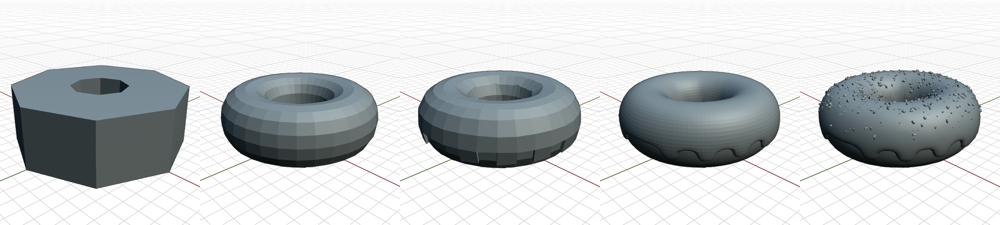

# Example uses of the procedural modeling API

## 01_Cube
  
Create a cube using extrusion, starting from a single vertex

## 02_Chair
  
Create a chair  

## 03_ParametricChair
  
Create a program which generates chair variations based on a random seed.  
For seeds [0-10] the back is not generated. for seeds [11-20] the back is generated. The random seed just works out that way and it's not a bug.

## 04_Airplane
  
Create a complex airplane mesh, with fuselage, wings, vertical and horizontal stabilizers.

## 05_Donut
  
Create a donut, with frosting and sprinkles. 

## build and install
### Clone the repo, update library (using git submodules)
`> git clone https://github.com/lsimic/AobaExamples.git`  
`> cd AobaExamples`  
`> git submodule update --init`  
`> git submodule update --remote`  

### Windows specific
Tested with Visual Studio Community 2019, open and build as any other CMake project

### LInux specific
`> cd out`  
`> cmake ..`  
`> make`  